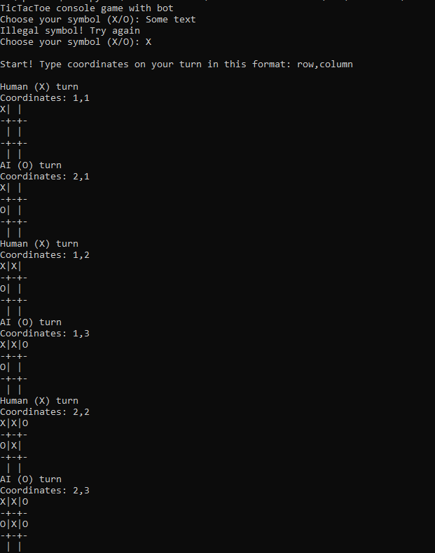
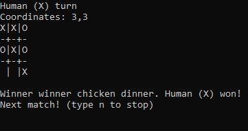

# Tic-Tac-Toe Console Game

A simple console-based implementation of tic-tac-toe where the player competes against a bot on a 3x3 grid.

# Technologies Used

The program was created using:
* IntelliJ IDEA 2024.1.4
* JDK 22.0.2
* JUnit 5.0.0 (while testing for such a small program proved to be more cumbersome than beneficial, I wanted to get some practice :) )

# Installation and Launch

1. Download and extract the TicTacToe-Console-Game archive from the [releases](https://github.com/qwert312/Tic-Tac-Toe-Console-game/releases/latest).
2. Run run.bat

To work with the source code, simply download and extract the Source archive from the same location, and then open the Tic-Tac-Toe-Console-game-1.0.0 folder.

# Usage

This is a classic tic-tac-toe game on a 3x3 grid. The game is designed for a single player, with the second player being a bot that randomly fills an empty cell on its turn (so, the AI isn't perfect).

At the start, the player can choose their game symbol X or O. The remaining symbol will be assigned to the bot. The player with the X symbol goes first.

During their turn, the player must enter the coordinates of the cell where they want to place their symbol. If the cell is already occupied, an error message will be displayed, and the player will be prompted to enter the coordinates again. After each move, the board's current state will be shown. The same applies to the bot, except it generates coordinates on its own and does not allow invalid input.

The game ends when either player creates a line of three symbols (horizontally, vertically, or diagonally), with a victory message displayed for the player who formed the line. If all cells are filled and no player has formed a line, the game ends in a draw.

After the match ends, the player is given the option to play again. To end the game, entering "n" (without quotes) is required. Any other input will restart the game.

